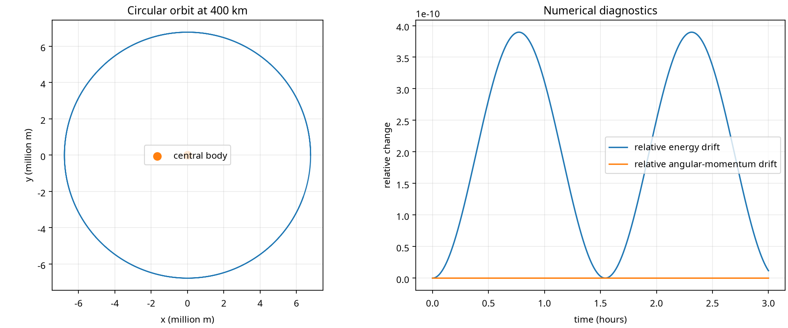

# Educational Rocket-Orbit Prototype

An educational Python prototype for orbital-mechanics calculators, ideal
rocket-equation exercises and a two-dimensional numerical orbit simulator,
designed for classroom use, scientific-software testing and algorithm
experimentation.

> **Code restricted:** the source code for this project is not published.
> Email **japurba97@gmail.com** for details and access.

> **Safety boundary:** this is not launch software. It does not implement
> guidance, navigation, targeting, actuator control, engine control, staging,
> telemetry commands or hardware interfaces, and its outputs must not be used for
> operational decisions.

## Capabilities

| Area | Included |
|---|---|
| Orbital calculators | Circular speed, circular period, escape speed, vis-viva, Hohmann transfer, orbital elements from a state vector |
| Rocket performance | Ideal Tsiolkovsky delta-v and ideal propellant fraction |
| Simulation | Planar two-body Newtonian propagation with velocity-Verlet integration |
| Diagnostics | Specific energy, specific angular momentum, radius, speed, eccentricity, periapsis and apoapsis |
| Visualisation | Trajectory and numerical-invariant drift plot |
| Education | Instructor manual, examples, automated tests and explicit model limitations |

## Sample results

For a circular orbit 400 km above Earth:

| Quantity | Value |
|---|---|
| Circular speed | 7,668.56 m/s |
| Orbital period | 1.543 h |
| Escape speed | 10,844.98 m/s |
| Ideal Hohmann delta-v to 800 km | 216.68 m/s |
| Ideal propellant fraction (1,000 kg dry mass) | 0.0667 |
| Relative energy drift over one simulated orbit | about 4 × 10⁻¹⁰ |

The project's automated test suite (11 tests) checks the calculators against
known values, the rocket equation in both directions, input validation, and the
conservation of energy and angular momentum in the simulator.

## Model limitations

The model is a point-mass, two-body, planar approximation. It omits atmospheric
flight, drag physics, lift, rotating-body effects, third-body gravity, body
oblateness, finite-duration burns, thermal effects, structural constraints,
propulsion transients, guidance, navigation and control. An optional linear drag
parameter only demonstrates how a perturbation changes energy; it is not an
atmosphere model.

## Documentation

- [`ARCHITECTURE.md`](ARCHITECTURE.md): design boundaries, assumptions and non-goals
- [`instructor_manual.md`](instructor_manual.md): lesson sequence, equations, exercises, assessment rubric and responsible-use guidance

## Credits

Created by **Janin A Apurba**. © 2026 Janin A Apurba. All rights reserved.
For the source code, email **japurba97@gmail.com**.
